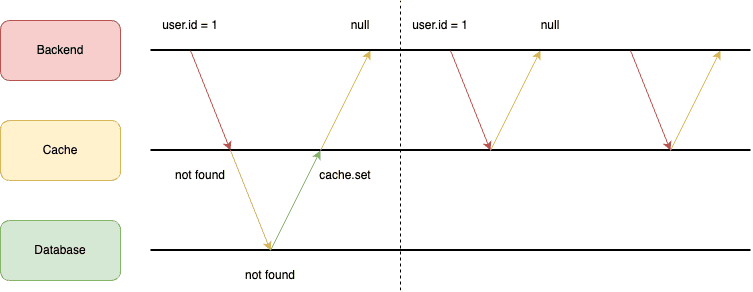

Cache is one of the most important part when building highly available application. It provides a high-performance way to get frequently accessed data and reduce traffic to our database.

Cache penetration is one of very first problem we should consider when utilizing cache in our application.

## What is cache penetration?

This is a scenario where data to be searched doesn't exist in our database and those empty data is not **cached** as well, so database always gets hit on every search.

This scenario can be leveraged to crash our system by spaming a large number of requests.

## Example

This is one simple way we often cache in our application.

Whenever request comes, we will search in cache first. If existed, we return data. Otherwise, we will find in our database, and then **cache** it and return data. So every following request on the same resource will hit cache instead of our database.

But let's consider when data is not found at cache, and data is not found in database as well.

The searched data is empty, and we may think "Oh it's empty, nothing to cache so just return to our client", so every following request on the same resource will hit our database and yep, that's the problem we have mentioned above.

## Solution

Easiest solution here is we have to cache those **empty data** as well. Remember to set ttl properly.

Another solution can be consider is to use [**Bloom Filter**](https://en.wikipedia.org/wiki/Bloom_filter). I don't know much about this algorithm so you guys can discover it by yourself haha.

## Conclusion
Be aware of cache problems will help us build a better application. Hope this will help.