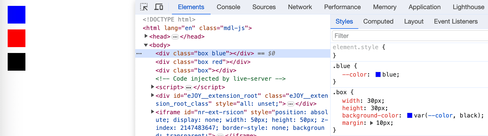

# How to use useContext with useReducer
Css variables are amazing. The common way to use is to often set them up in **:root**. But they can be much more useful than that.

Let's take an example

```html filename="index.html"
<head>
  <style>
    .box {
      width: 30px;
      height: 30px;
      background-color: var(--color, black); /** fallback color is `black` */
      margin: 10px;
    }

    .blue {
      --color: blue;
    }

    .red {
      --color: red;
    }
  </style>
</head>
<body>
  <div class="box blue"></div>
  <div class="box red"></div>
  <div class="box"></div>
</body>
```

And here we go, we get the result like this


## Conclusion
This technique gives us a more flexible way to use css variable with class. I think it will be super helpful.

Thanks for reading.